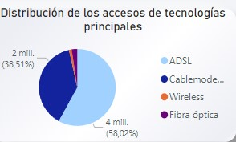
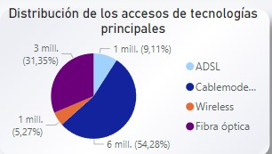

## <h1 align=center> SEGUNDI PROYECTO INDIVIDUAL </h1>

# <h1 align=center> Proyecto de Análisis de Internet - Telecomunicaciones  </h1>

¡Bienvenidx a mi repositorio del proyecto de análisis de telecomunicaciones - Internet! 

En este proyecto se presenta un análisis exhaustivo que aborda el acceso a internet en Argentina, medido por provincia y nacionalidad, además de ingresos con el valor del dólar. Los datos se obtienen de la página de ENACOM.

# Un poco sobre las Telecomunicaciones

Las telecomunicaciones son fundamentales para la transmisión de información a través de diversos medios electrónicos como telefonía, televisión, radio e internet. Internet, en particular, ha revolucionado la forma en que nos comunicamos, trabajamos y accedemos a la información globalmente. Desde su creación, ha facilitado la interconexión de dispositivos y personas en tiempo real, transformando la sociedad y permitiendo una comunicación continua incluso en situaciones de crisis como pandemias.

## Descripción del Repositorio
## Tecnologías utilizadas
Python 3.7 
pandas
matplotlib
seaborn
power BI

## Extracción, Transformación y Carga (ETL)

  
Descripción ETL

 En este notebook se puede observar un trabajo previo de limpieza, selección y
breve análisis a partir del archivo excel dado. A partir del cual se tiene un primer acercamiento a los datos, donde luego de revisarlos, se selecciona y se los exporta para su posterior análisis.

## Análisis Exploratorio de Datos (EDA)

  
Descripción EDA

   Este notebook contiene un análisis detallado sobre el acceso a internet en Argentina. Se exploran datos por provincia y a nivel nacional, identificando tendencias, valores atípicos y áreas de oportunidad. Las conclusiones se presentan de manera clara y están respaldadas por gráficos informativos.

   
## Dashboard Interactivo

  
Descripción Dashboard

  Se ha implementado un dashboard interactivo que permite explorar los datos de manera dinámica. Incluye visualizaciones que facilitan entender la distribución del acceso a internet, la relación con los ingresos a valor del dólar en Argentina, y también los KPI propuestos. Este dashboard está diseñado para ser claro y efectivo en la presentación de información relevante.

## Reporte de Análisis y KPIs

A continuación se presentan los hallazgos más significativos derivados del análisis exploratorio y del dashboard interactivo. 

Se visualizan los KPIs propuestos, como el aumento del acceso a internet en un 2% por cada 100 hogares por provincia, junto con otros indicadores clave que ayudan a evaluar el desempeño del sector.

La distribución del acceso a internet por provincia y su comparación entre diferentes años

La relación entre los ingresos y el acceso a internet, considerando la fluctuación del valor del dólar en Argentina.
Gráficos interactivos que facilitan la exploración y comprensión de los datos presentados.

  
Ver Análisis

  Definiciones de Términos Clave

● Accesos: Se refiere al número de conexiones a internet registradas. Estas conexiones pueden ser a través de diversas tecnologías como ADSL, fibra óptica, etc

● Penetración: Es el porcentaje de hogares o individuos que tienen acceso a internet en una determinada área geográfica. Se puede medir en términos de penetración en la población o en los hogares.

● Velocidad de Conexión: Clasificación de las conexiones a internet según la velocidad de descarga, expresada en Mbps (Megabits por segundo)

● Tecnología de Conexión: Tipo de tecnología utilizada para proporcionar el servicio de internet, como ADSL, fibra óptica, cable módem, dial-up, etc.

● Ingresos: Monto de dinero generado por los servicios de internet en un periodo específico, expresado en miles de pesos.

  Centraandonos en buscar la relación de accesos a internet, y el comportamiento de esta métrica, se comienza a analizar los datos de penetración por provincia a lo largo del periodo comprendido entre el 2014 y el 2023. Por lo cual se prioriza analizar por 'Accesos cada 100 hogares', a contuniacion presento los hallazgos: 
  
  

En este gráfico encuentro muchos valores atípicos o fuera del rango intercuarti. Luego de investigar los registros con dichos valores se pudo notar que todos los outliers son de capital federal para Accesos por cada 100 hogares, lo mismo oocurre en 'Accesos por cada 100 hab', pudiendo concluir que en la provincia existe por mucho un gran acceso y demanda de servicio de internet.

Se observa un gran crecimiento entre los años 2014 y 2022, siendo en 2016 una gran aceleracion en cuanto acceso cada 100 hogares. Al parecido sucede con respecto al acceso cada 100 habitantes, aunquie esta diferencia no esta tan marcada

Analicemos un grafico de barras para ver la tendencia a través de los años para el acceso cada 100 habitantes y 100 hogares a nivel provincial.

  
  Aqui se visualiza una distribución de penetracion de accesos por provincia, en la cual podemos ver la amplia diferencia entre estas. Respaldando lo anterior.

Tecnologias:
   

  
  

En 2014, el ADSL era la tecnología más comúnmente utilizada. Desde 2020, el cable módem se ha establecido como la tecnología predominante. Para 2023, la fibra óptica se ha posicionado como la segunda opción más popular en todo el país.

Ingresos:
  

  Se observa una disminución en los ingresos entre los años 2018 y 2023, después de un notable incremento en el período de 2014 a 2018. Este comportamiento refleja una tendencia real, considerando los datos de inflación y la cotización del dólar oficial en Argentina.

  # KPIs propuestos
  
Aumentar en un 2% el acceso por provincia al servicio de internet para el próximo trimestre por cada 100 hogares, por provincia.
  
Aumentar en un 2% el acceso por provincia al servicio de internet para el próximo trimestre para la tecnología Wireless 

Aumentar en un 2% el acceso por provincia al servicio de internet para el próximo trimestre para la tecnología Fibra Óptica 

 

 

  # Conclusiones 
  
  Se pudo observar una tendencia al aumento de accesos a internet en todo el país, con una notable aceleración a partir de 2016, a pesar de que esta tendencia se ha estado observando desde 2014.
  
  A modo de conclusión, aunque en 2014 la tecnología más utilizada era el ADSL, desde 2020 el cable módem ha pasado a ser la tecnología predominante. Para 2023, la fibra óptica se ha convertido en la segunda opción más popular a nivel nacional. A pesar de la disminución en el número de usuarios de ADSL, una parte significativa de la población aún la utiliza. Además, se puede observar una tendencia creciente en el uso de la tecnología inalámbrica, que era mínima en años anteriores, especialmente hacia 2022.

  En términos de ingresos, se observa un incremento que alcanza un pico en 2017. En los años subsiguientes, se ve una cinsiderable baja, aunque en la moneda local esto es difícil de apreciar ya que se ve una considerable subida; sin embargo, al considerar los datos inflacionarios de Argentina y medirlos en dólares estadounidenses (tomando el dólar oficial), se percibe una caída significativa. Esto está estrechamente relacionado con la inflación del país.
  

¡Gracias por visitar este repositorio y por tu interés en el proyecto de análisis de Internet en Argentina!

## Contribuciones
Las contribuciones son bienvenidas. Por favor, abre un issue o un pull request para discutir cualquier cambio importante.

## Mis datos
linkedin 
www.linkedin.com/in/nissedgonzalezm
